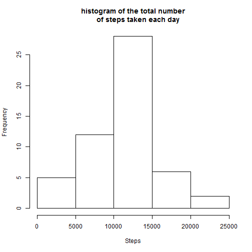
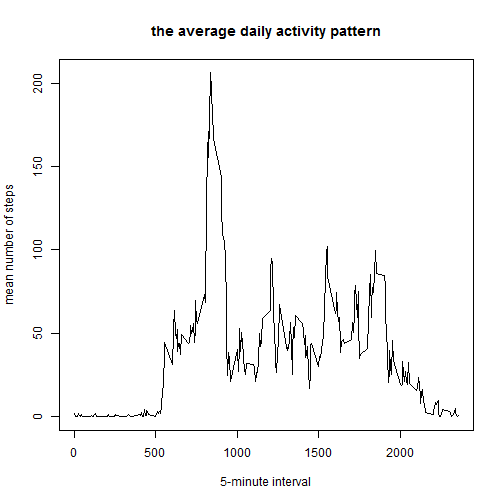
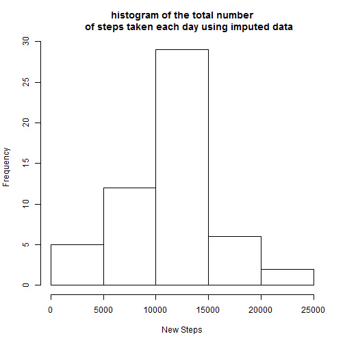
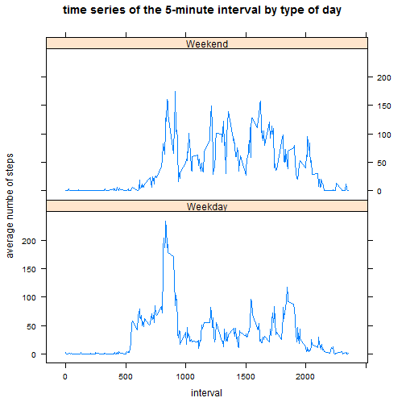

# Course Project 1

## load neccessary libraries for performing the anlysis


```r
library(ggplot2)
library(plyr)
library(lattice)
```

## read in data from activity.cvs file available from course website and process and transform data into a suitable format


```r
# set working directory
setwd("~/MOOC - Data Science/Part 5/Course Project 1")

# read in data
data <- read.csv("activity.csv", header = TRUE, na.strings = "NA")

# format date and interval fields
data$date <- as.POSIXct(data$date, format = "%Y-%m-%d")

# create a file with no na values for steps
nonadata <- data[!is.na(data$steps),]
```

## computing mean total number of steps taken per day (ignoring na valules)


```r
# calculate total number of steps per day
totalsteps <- aggregate(steps ~ date, data = nonadata, FUN = sum)

# create a histogram of the total number of steps taken each day
hist(totalsteps$steps, xlab = "Steps", main = "histogram of the total number
     of steps taken each day")
```



```r
# calculate and report the mean and median of the total number of steps taken
# per day

daymean <- mean(totalsteps$steps)
daymean
```

```
## [1] 10766.19
```

```r
daymedian <- median(totalsteps$steps)
daymedian
```

```
## [1] 10765
```

### mean of the total number of steps taken per day is equal to 10766 and median of the total number of steps taken per dat is equal to 10765

# calculating the average daily activity pattern


```r
# calculate mean number of steps per interval
meansteps <- aggregate(steps ~ interval, data = nonadata, FUN = mean)

# plot the time series
with(meansteps, 
        plot(interval, steps, type = "l",
             xlab = "5-minute interval", ylab = "mean number of steps",
             main = "the average daily activity pattern")
)
```



```r
# find 5-minute interval, on average across all the days in the dataset, 
# contains the maximum number of steps

intwmaxs <- meansteps[meansteps$steps == max(meansteps$steps),]
intwmaxs
```

```
##     interval    steps
## 104      835 206.1698
```

### interval 835 has the maximum (i.e., 206) number of average steps per day

## imputing missing values


```r
nalogic <- ifelse(is.na(data$steps), TRUE, FALSE)
countna <- table(nalogic)[[2]]
```

### there are 2304 missing values in the data set

### the strategy for filling in all of the missing values in the dataset is to use the mean for that 5-minute interval


```r
# create a new column to populate with mean of steps in that interval if na
data$newsteps <- ifelse(is.na(data$steps), meansteps[meansteps$interval == data$interval,][[2]], 
                        data$steps)

# calculate total number of steps per day using the imputed dataset
totalnewsteps <- aggregate(newsteps ~ date, data = data, FUN = sum)

# create a histogram of the total number of steps taken each day
hist(totalnewsteps$newsteps, xlab = "New Steps", main = "histogram of the total number
     of steps taken each day using imputed data")
```



```r
# calculate and report the mean and median of the total number of steps taken
# per day using the imputed dataset

daymeann <- mean(totalnewsteps$newsteps)
daymeann
```

```
## [1] 10766.19
```

```r
daymediann <- median(totalnewsteps$newsteps)
daymediann
```

```
## [1] 10765.59
```

### using imputed dataset, mean of the total number of steps taken per day is equal to 10766 and median of the total number of steps taken per dat is equal to 10765. These values are diffeerent but close to the previous values where data was not imputed.

## differences in activity patterns between weekdays and weekends

```r
# create a new factor variable in the dataset with two levels - "weekday" and
# weekend" indicating whether a given date is a weekday or weekend day
data$day <- as.factor(ifelse(weekdays(data$date) %in% c("Sunday", "Saturday"),
                             "Weekend", "Weekday"))

# create a new dataset for the plot
daydata <- aggregate(newsteps ~ interval + day, data = data, FUN = mean)

# panel plot containing a time series plot of the 5-minute interval
# (x-axis) and the average number of steps taken, averaged across
# all weekday days or weekend days (y-axis)
xyplot(newsteps ~ interval | day, data = daydata, type = "l", layout = c(1,2),
       xlab = "interval", ylab = "average numbe of steps", 
       main = "time series of the 5-minute interval by type of day")
```



### the plots above show that the patterns of average steps of the intervals for weekdays and weekends are different.


